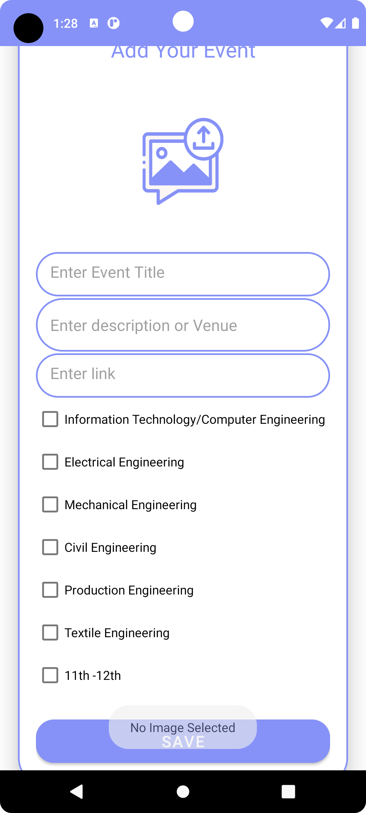

# EventInsti

## Project Overview

**EventInsti** is a web application designed to facilitate seamless interaction between Students, Institutes, and Admin. The platform allows users to sign up, log in, and manage their profiles. Students can explore and participate in events hosted by Institutes, while Institutes can efficiently organize and manage events for specific student categories. Admin plays a crucial role in verifying and approving Institutes.

## Table of Contents

- [Features](#features)
- [Installation](#installation)
- [Usage](#usage)
- [Screenshots](#screenshots)
- [Project Description](#project-description)
- [Contributing](#contributing)
- [License](#license)

## Features

1. **Authentication and Registration:**
   - Users can sign up with their basic details, including email, password, and additional information based on their role (Student or Institute).
   - Firebase Realtime Database is utilized for secure storage of user data.

2. **Student Page:**
   - Upon login, students are directed to their personalized page where they can view and edit their profiles.
   - Students can access a list of events uploaded by Institutes based on their selected branch and field during registration.
   - Search functionality enables students to find Institutes, event details, and profiles.

3. **Event Details:**
   - Students can view event details, including Event Title, Event Image, Venue, Institute Name, and Verification Status.
   - A link is provided to redirect students to the registration website of the respective Institute.

4. **Institute Page:**
   - Institutes can check their verification status and edit their profiles.
   - Events can be uploaded by Institutes with details such as name, link, image, etc.
   - Institutes can specify the category of students (field and branch) who can view their events.

5. **Admin Page:**
   - Admin can approve Institutes based on their legitimacy, marking them as verified.
   - Admin has a comprehensive view of all registered Institutes.

## Installation

1. Clone the repository to your local machine.
2. Install the necessary dependencies using `npm install`.
3. Set up Firebase Realtime Database and configure the project with your Firebase credentials.
4. Run the application using `npm start`.

## Usage

1. Access the application through the provided URL.
2. Sign up as a Student or Institute with the required details.
3. Log in using the created credentials.
4. Navigate to the respective pages (Student, Institute, or Admin) and utilize the features based on your role.

## Screenshots

- **Signup Page**
  

  - **Login Page**
  

- **Institute Signup (Step 1)**
  

- **Institute Signup (Step 2)**
  

  - **Student Signup**
  

- **Student Main Page**
  

- **Event Details**
  

- **User Profile**
  

- **Institute Page**
  

  - **Upload Page**
  

    - **Admin Page**
  

- **Institute Details (Approved)**
  

## Project Description

I am the proud creator of **EventInsti**, a dynamic Android application crafted with passion and precision using Java in Android Studio. This project demonstrates my proficiency in mobile app development and showcases my ability to create a user-friendly and feature-rich experience.

## Project Highlights:

### Seamless User Authentication:
Implemented a robust user authentication system allowing students, institutes, and administrators to securely sign up, log in, and manage their profiles within the app.

### Firebase Integration:
Utilized Firebase Realtime Database for efficient and secure storage of user data, enhancing the app's scalability and performance.

### Role-Based Functionalities:
Designed distinct features for Students, Institutes, and Admin, ensuring a tailored and intuitive experience for each user role.

### Student-Centric Features:
- **Personalized Student Page:** Upon login, students are directed to a customized page where they can view and edit their profiles.
- **Event Exploration:** Students can explore a curated list of events uploaded by Institutes, filtered based on their selected branch and field during registration.
- **Event Details:** Detailed event information, including title, image, venue, institute name, and verification status, enhances the student's event discovery experience.

### Institute Management Tools:
- **Verification Status:** Institutes can check their verification status and conveniently edit their profiles.
- **Event Organization:** Institutes can effortlessly upload events with comprehensive details such as name, link, image, etc. They can also specify the category of students who can view their events based on field and branch.

### Admin Oversight:
- **Verification Process:** Admins have a streamlined interface to verify and approve institutes, ensuring the legitimacy of registered entities.
- **Comprehensive Admin View:** The admin panel provides an overview of all registered institutes, facilitating efficient management.

### Technical Stack:
- Android Studio
- Java
- Firebase Realtime Database

### Achievement:
Successfully developed and deployed a fully functional Android application that seamlessly connects students, institutes, and administrators, demonstrating my expertise in mobile app development and commitment to delivering impactful solutions.

**Project Status:** Active, with ongoing updates and enhancements.

I am excited about the opportunity to discuss this project in more detail and showcase how it has contributed to my growth as a developer.

## Contributing

If you'd like to contribute to this project, please follow the [Contribution Guidelines](CONTRIBUTING.md).

## License

This project is licensed under the [Apache License](LICENSE).
